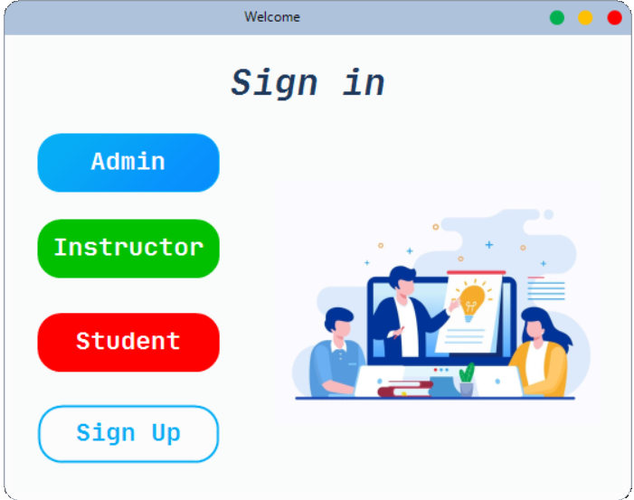

# Desktop Learning Platform

A C# Desktop Platform that allows for ease of 
interaction between students and instructors where this platform 
allows the instructors to assess their student through online MCQ 
exams and assignments. In addition, the students can review their 
grades and progress through their enrolled courses.

## Used By

This project can used by any istitution that have the following three main users:
- Admins
- Instructors
- Students

## Tech Stack

**Client:** Microsoft .Netframework, [Krypton UI Toolkit](https://github.com/ComponentFactory/Krypton), [SAP crystal reports](https://www.sap.com/products/technology-platform/crystal-reports.html)

**Server:** Azure SQL Database server
 
Database schema was defined using [Datagrip](https://www.jetbrains.com/datagrip/) tool  and hosted onto azure SQL server, canned transactions were done by using stored procedures in SQL server, then the frontend and dealing with the server was done by .NET framework to have a complete solution.

 

## Features 

### For Admins
- Manage Students, Instructors, other Admins profile data
- Track the history of transactions(operations) done on any user

### For Instructors
- Create new classrooms and generate access code
- Generating MCQ exams and determines its date, time and marks weight
- Posts on a classroom timeline
- Generate reports and stastics about student grades
- Review student assignments Submissions

### For Students 
- Enroll to classrooms by using a unique access code
- Review personal grades
- View and submits assignments
- Takes an online MCQ exam 
- Add a comment on a timeline post 

## Database Entity-Relationship diagram

## Screenshots Samples
Adding an admin

Adding Instructor by an admin

Activating, Deactivating, Editing account by an admin

Viewing history of processes done on a certain user

Instructor Homepage

Viewing a classroom from instructor's side

Question bank from instructor's side

Timeline

Adding Questions to Exam

Student Homepage

Student Self-Enrollment

Classroom from student's side

Student Uploading Assignment

PDF that was generated by SAP statistical report by integration with the application to perform some statistics on students data

Another PDF that was generated by SAP statistical report by integration with the application

## Lessons Learned

- Using SQL intensively and being familiar with SQL syntax and built-in functions
- Using hosting solution (azure)
- How to build software with .NET framework
- Being familiar with C# syntax

## What is next?
Transforming the idea into a web application in a more fancy manner.
